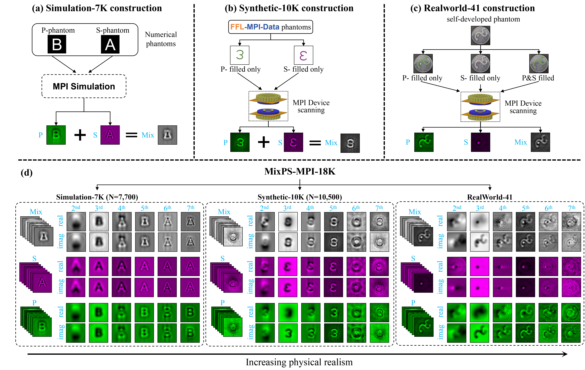
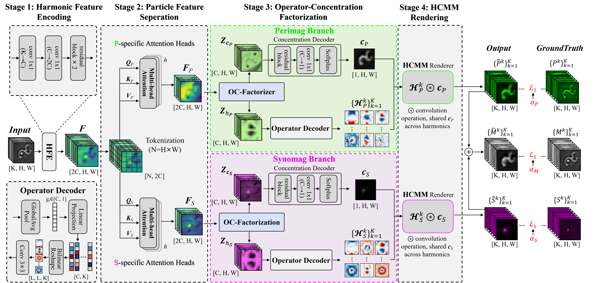

# MixPS-MPI-18K and MixPS-Net

[](https://www.python.org/)
[](https://pytorch.org/)
[](LICENSE)
[](https://doi.org/10.5281/zenodo.22069325)

This repository provides **MixPS-MPI-18K**, a paired multi-harmonic benchmark
for dual-tracer magnetic particle imaging (MPI), and **MixPS-Net**, its
physics-guided reference model for separating Perimag (**P**) and Synomag-70
(**S**) from a mixed measurement (**M**).

- Dataset: 18,241 standard paired HDF5 samples across simulation, synthetic,
  and real-world domains.
- Input: 12 signed channels containing the real and imaginary components of
  the `2f`--`7f` harmonics.
- Output: separated 12-channel Perimag and Synomag harmonic images.
- Model prior: a tracer-specific concentration field is shared across all
  harmonic operators in the Harmonic Convolutional Mixing Model (HCMM).

Dataset record: [Zenodo 10.5281/zenodo.22069325](https://doi.org/10.5281/zenodo.22069325)

Project repository: [BUAALGH/MixPS-MPI-18K](https://github.com/BUAALGH/MixPS-MPI-18K)

## Dataset overview



**Figure 1.** MixPS-MPI-18K contains paired mixed, Perimag, and Synomag
harmonic images from simulation, synthetic phantom, and real MPI measurements.

| Subset | Train | Validation | Test | Total | Domain |
| --- | ---: | ---: | ---: | ---: | --- |
| `MixPS-Simulation-7K` | 6,300 | 700 | 700 | 7,700 | MNIST-derived simulation |
| `MixPS-Synthetic-10K` | 7,350 | 1,575 | 1,575 | 10,500 | Paired phantom synthesis |
| `MixPS-Realworld-41` | 0 | 0 | 41 | 41 | Real MPI measurements |
| **Standard benchmark** | **13,650** | **2,275** | **2,316** | **18,241** | |

`MixPS-Simulation-7K/test/mix_00701.h5` is an optional strong P-dominant
stress sample (`Alpha=50`, `Beta=1`) and is excluded from the standard test
set. Consequently, an extracted release containing this supplemental sample
has 18,242 HDF5 files but still has 18,241 standard benchmark samples.

### HDF5 schema

Each `mix_XXXXX.h5` file stores:

```text
mix_XXXXX.h5
├── /mix/image/real    [6, 64, 64]
├── /mix/image/imag    [6, 64, 64]
├── /P/image/real      [6, 64, 64]
├── /P/image/imag      [6, 64, 64]
├── /S/image/real      [6, 64, 64]
├── /S/image/imag      [6, 64, 64]
└── root attributes    acquisition or synthesis metadata
```

The six planes correspond to `2f`--`7f`; the model channel order is
`[Re(2f), ..., Re(7f), Im(2f), ..., Im(7f)]`. For simulation and synthetic
data, `M = P + S` by construction after applying the stored tracer mixing
coefficients. For RealWorld-41, M, P, and S are paired acquisitions: M is an
independently measured mixture, so exact element-wise additivity is not
assumed.

Place the downloaded data outside Git tracking using this layout:

```text
/path/to/MixPS-MPI-18K/data/
├── MixPS-Simulation-7K/{train,val,test}/mix_*.h5
├── MixPS-Synthetic-10K/{train,val,test}/mix_*.h5
└── MixPS-Realworld-41/test/mix_*.h5
```

## MixPS-Net



**Figure 2.** Four-stage MixPS-Net architecture. The model separates
particle-specific features and explicitly factorizes each branch into a
shared concentration field and harmonic-dependent signed operators before
HCMM rendering.

The implementation contains four stages:

1. **Harmonic Feature Encoding (HFE).** Two `1x1` projections and two
   reflection-padded residual blocks map
   `M [B,K,H,W]` to `F [B,2C,H,W]`.
2. **Particle Feature Separation (PFD).** Independent P- and S-specific
   two-head self-attention branches produce
   `F_P,F_S [B,2C,H,W]` from all `H*W` spatial tokens.
3. **Operator-Concentration Factorization.** Each particle branch is
   decomposed into concentration and operator latents
   `Z_c,Z_h [B,C,H,W]`. Softplus makes the decoded concentration
   nonnegative, whereas the harmonic operators remain signed.
4. **HCMM Rendering.** For tracer `t` and harmonic `k`, the prediction is
   `Y_hat_t^k = H_t^k * c_t`. The same `c_t` is shared across all harmonics,
   and the reconstructed mixture is `M_hat = P_hat + S_hat`.

The default configuration uses `K=12`, `C=32`, two attention heads,
`64x64` inputs, and `21x21` harmonic operators. It contains 403,370 trainable
parameters.

## Installation

Python 3.9+ and PyTorch 2.1+ are required.

```bash
git clone https://github.com/BUAALGH/MixPS-MPI-18K.git
cd MixPS-MPI-18K/MixPS-Net
python -m venv .venv
source .venv/bin/activate
python -m pip install --upgrade pip
python -m pip install -e .
```

## Training

The reference experiment trains for **100 epochs** with AdamW, cosine
learning-rate decay, batch size 8, and seed 42:

```bash
CUDA_VISIBLE_DEVICES=0 python train.py \
  --config configs/mixps_net.yaml \
  --data-root /path/to/MixPS-MPI-18K/data \
  --output-dir runs/mixps_net
```

Only Simulation-7K and Synthetic-10K training splits are used for
optimization. RealWorld-41 is held out for testing. One MaxAbs scale computed
from M is shared by its paired M, P, and S tensors.

Resume an interrupted run without changing the experiment directory:

```bash
CUDA_VISIBLE_DEVICES=0 python train.py \
  --config configs/mixps_net.yaml \
  --data-root /path/to/MixPS-MPI-18K/data \
  --output-dir runs/mixps_net \
  --resume runs/mixps_net/last.pt
```

### Reference configuration

| Item | Value |
| --- | --- |
| Epochs / batch size | 100 / 8 |
| Optimizer | AdamW |
| Initial / minimum learning rate | `1e-4` / `1e-6` |
| Weight decay | `1e-5` |
| Scheduler | Cosine annealing |
| Loss weights `(P,S,M)` | `(1.0, 1.0, 0.25)` |
| Seed | 42 |
| Training augmentation | Random flips and 90-degree rotations |

Training writes `best.pt`, `last.pt`, `history.json`, and a copy of the
resolved configuration to the selected output directory.

## Evaluation

```bash
CUDA_VISIBLE_DEVICES=0 python evaluate.py \
  --checkpoint runs/mixps_net/best.pt \
  --data-root /path/to/MixPS-MPI-18K/data \
  --output runs/mixps_net/metrics.json
```

The evaluator reports the mean and population standard deviation of
per-sample, per-harmonic PSNR and SSIM for P and S on all three test subsets.
Each channel uses its ground-truth dynamic range. The optional simulation
stress sample is excluded by default.

## Reproducibility check

The complete protocol is in
[`configs/mixps_net.yaml`](configs/mixps_net.yaml). The fixed seed controls
Python, NumPy, and PyTorch, and deterministic CUDA behavior is enabled by
default.

```bash
python -m pip install pytest
python -m pytest tests/test_model.py
```

The default reconstruction objective is:

```text
L = 1.0 * L1(P_hat,P) + 1.0 * L1(S_hat,S) + 0.25 * L1(M_hat,M)
```

## Citation

If this dataset or implementation is useful, please cite the dataset record:

```bibtex
@dataset{li_2026_mixps_mpi_18k,
  author    = {Li, Guanghui},
  title     = {MixPS-MPI-18K: A Paired Harmonic-Image Dataset for
               Dual-Tracer Magnetic Particle Imaging},
  year      = {2026},
  publisher = {Zenodo},
  doi       = {10.5281/zenodo.22069325},
  url       = {https://doi.org/10.5281/zenodo.22069325}
}
```

## License and contact

MixPS-Net source code is released under the [MIT License](LICENSE). Dataset
use is governed by the license shown in its Zenodo record.

Contact: Guanghui Li, Beihang University (BUAA),
`liguanghui@buaa.edu.cn`.
